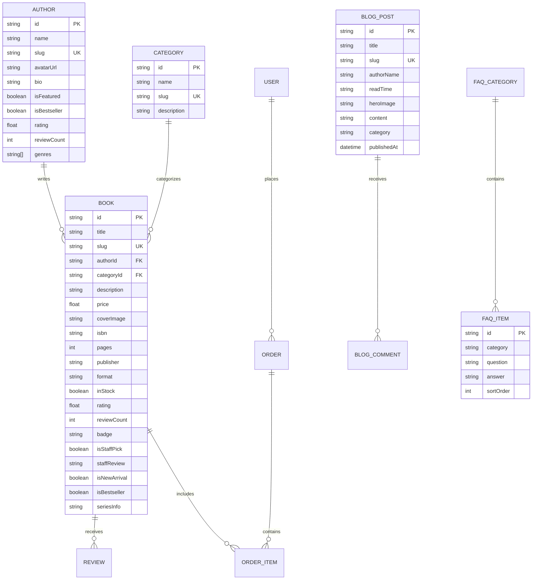

# 13. Data Architecture, Prisma Schema & Data Flow

This document details the relational entity-relationship model, database schema, Prisma definitions, and TypeScript interfaces needed to fully back all 11 full-screen pages in the Bookstore project.

---

## 1. Entity-Relationship Overview



---

## 2. Complete Prisma Schema (`prisma/schema.prisma`)

```prisma
generator client {
  provider = "prisma-client-js"
}

datasource db {
  provider = "mongodb"
  url      = env("DATABASE_URL")
}

model User {
  id           String    @id @default(auto()) @map("_id") @db.ObjectId
  name         String
  email        String    @unique
  passwordHash String
  role         String    @default("CUSTOMER") // CUSTOMER, ADMIN
  orders       Order[]
  reviews      Review[]
  createdAt    DateTime  @default(now())
  updatedAt    DateTime  @updatedAt
}

model Author {
  id           String    @id @default(auto()) @map("_id") @db.ObjectId
  name         String
  slug         String    @unique
  avatarUrl    String?
  bio          String?
  isFeatured   Boolean   @default(false)
  isBestseller Boolean   @default(false)
  rating       Float     @default(4.5)
  reviewCount  Int       @default(0)
  genres       String[]  // ["Sci-Fi", "Fantasy", "Mystery"]
  books        Book[]
  createdAt    DateTime  @default(now())
  updatedAt    DateTime  @updatedAt
}

model Category {
  id          String    @id @default(auto()) @map("_id") @db.ObjectId
  name        String
  slug        String    @unique
  description String?
  books       Book[]
  createdAt   DateTime  @default(now())
  updatedAt   DateTime  @updatedAt
}

model Book {
  id           String      @id @default(auto()) @map("_id") @db.ObjectId
  title        String
  slug         String      @unique
  authorId     String      @db.ObjectId
  author       Author      @relation(fields: [authorId], references: [id])
  categoryId   String      @db.ObjectId
  category     Category    @relation(fields: [categoryId], references: [id])
  description  String
  price        Float
  currency     String      @default("USD")
  coverImage   String
  galleryImages String[]   @default([])
  isbn         String?
  pages        Int?
  publisher    String?
  format       String      @default("Hardcover") // Hardcover, Paperback, Audiobook, E-book
  inStock      Boolean     @default(true)
  stockCount   Int         @default(25)
  rating       Float       @default(5.0)
  reviewCount  Int         @default(0)
  badge        String?     // BESTSELLER, #1 BESTSELLER, STAFF PICK, TOP RATED
  isStaffPick  Boolean     @default(false)
  staffReview  String?
  isNewArrival Boolean     @default(false)
  isBestseller Boolean     @default(false)
  seriesInfo   String?     // "Book 1 of 2", "Standalone", "Graphic Novel"
  dimensions   String?     // "6.4 x 1.5 x 9.5 inches"
  language     String      @default("English")
  reviews      Review[]
  orderItems   OrderItem[]
  createdAt    DateTime    @default(now())
  updatedAt    DateTime    @updatedAt
}

model Review {
  id          String    @id @default(auto()) @map("_id") @db.ObjectId
  bookId      String    @db.ObjectId
  book        Book      @relation(fields: [bookId], references: [id], onDelete: Cascade)
  userId      String?   @db.ObjectId
  user        User?     @relation(fields: [userId], references: [id])
  reviewerName String
  rating      Int       @default(5)
  title       String?
  content     String
  isVerified  Boolean   @default(true)
  source      String    @default("Goodreads") // Goodreads, Store, Editorial
  createdAt   DateTime  @default(now())
}

model BlogPost {
  id           String    @id @default(auto()) @map("_id") @db.ObjectId
  title        String
  slug         String    @unique
  authorName   String
  readTime     String    // "6 MIN READ"
  heroImage    String
  excerpt      String
  content      String    // Markdown or rich HTML
  category     String    // "READING LISTS", "AUTHOR INTERVIEWS", "COMMUNITY PICKS"
  publishedAt  DateTime  @default(now())
  createdAt    DateTime  @default(now())
  updatedAt    DateTime  @updatedAt
}

model FaqItem {
  id        String   @id @default(auto()) @map("_id") @db.ObjectId
  category  String   // ALL, SHIPPING, ORDERS, RETURNS, PAYMENTS
  question  String
  answer    String
  sortOrder Int      @default(0)
  isActive  Boolean  @default(true)
}

model ContactMessage {
  id        String   @id @default(auto()) @map("_id") @db.ObjectId
  name      String
  email     String
  subject   String
  message   String
  status    String   @default("UNREAD") // UNREAD, REPLIED, ARCHIVED
  createdAt DateTime @default(now())
}

model Order {
  id          String      @id @default(auto()) @map("_id") @db.ObjectId
  userId      String?     @db.ObjectId
  user        User?       @relation(fields: [userId], references: [id])
  customerEmail String
  customerName  String
  items       OrderItem[]
  totalAmount Float
  status      String      @default("PENDING") // PENDING, PROCESSING, SHIPPED, DELIVERED
  createdAt   DateTime    @default(now())
}

model OrderItem {
  id       String @id @default(auto()) @map("_id") @db.ObjectId
  orderId  String @db.ObjectId
  order    Order  @relation(fields: [orderId], references: [id], onDelete: Cascade)
  bookId   String @db.ObjectId
  book     Book   @relation(fields: [bookId], references: [id])
  format   String
  quantity Int    @default(1)
  unitPrice Float
}
```

---

## 3. Seed Data Specification

To guarantee 100% visual fidelity with the Figma designs upon initial load, the database seed must include:

### 3.1 Authors
- **Andy Weir** (`slug: "andy-weir"`)
  - Avatar: Professional headshot
  - Bio: *"Andy Weir built a career as a software engineer until the success of his first published novel, The Martian, allowed him to live out his dream..."*
  - Genres: `["Sci-Fi", "Hard Sci-Fi"]`
  - isFeatured: `true`, isBestseller: `true`, rating: `4.5`, reviewCount: `2345`
- **Eleanor Vance** (`slug: "eleanor-vance"`): 12 books, Sci-Fi.
- **Arthur Pendelton** (`slug: "arthur-pendelton"`): 8 books, Fantasy.
- **Silvia Moreno** (`slug: "silvia-moreno"`): 15 books, Mystery.
- **James S.A.** (`slug: "james-sa"`): 22 books, Literary.
- **N.K. Jemisin** (`slug: "nk-jemisin"`): Three-time Hugo Award winner, Featured Author.
- **Neil Gaiman** (`slug: "neil-gaiman"`): Master of modern fantasy, Featured Author.
- **Donna Tartt** (`slug: "donna-tartt"`): Pulitzer Prize-winning novelist, Featured Author.

### 3.2 Featured Books
- **Project Hail Mary** by Andy Weir: Price `$24.99`, Format `Hardcover`, Rating `4.8`, Pages `480`, Publisher `Ballantine Books`, ISBN `978-0593135204`, Badge `BESTSELLER`.
- **The Martian** by Andy Weir: Price `$18.99` (Paperback `$14.99`), Series `STANDALONE`.
- **Artemis** by Andy Weir: Price `$16.00`, Series `STANDALONE`.
- **Cheshire Crossing** by Andy Weir: Price `$22.50`, Series `GRAPHIC NOVEL`.
- **The Overstory** by Richard Powers: Price `$19.95`, Badge `STAFF PICK`, Staff Review included.
- **The Midnight Library** by Matt Haig: Price `$24.99`, Rating `4.6`.
- **Tomorrow, and Tomorrow, and Tomorrow** by Gabrielle Zevin: Price `$26.00`.
- **Lessons in Chemistry** by Bonnie Garmus: Price `$29.00`, Badge `BESTSELLER`.
- **Klara and the Sun** by Kazuo Ishiguro: Price `$26.50`.
- **Yellowface** by R.F. Kuang: Price `$27.00`.
- **Demon Copperhead** by Barbara Kingsolver: Price `$22.50`.
- **The Silent Patient** by Alex Michaelides: Price `$17.49`.
- **The Invisible Life of Addie LaRue** by V.E. Schwab: Price `$26.00`.
- **Normal People** by Sally Rooney: Price `$16.00`.
- **Educated** by Tara Westover: Price `$17.99`.
